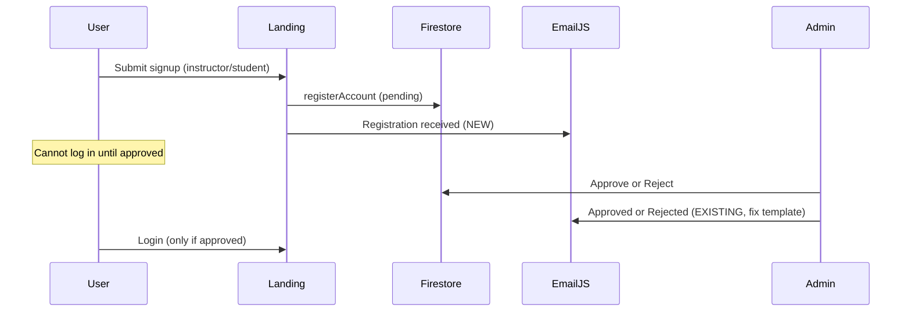

# Signup & Account Email Notification — Implementation Plan

This document plans email notifications for **self-registration (signup)** and the full **pending → approved / rejected** lifecycle. It builds on the current AttendEase flows in `landing.ts`, `student-api.service.ts`, `pending-account-approval`, and `AccountEmailService`.

---

## 1. Goals

| Goal | Description |
|------|-------------|
| **Signup confirmation** | After a user submits instructor or student signup, send a clear “registration received” email (not approval yet). |
| **Correct lifecycle emails** | Approved and rejected emails must show the right subject and body (not the archive wording). |
| **Optional admin alert** | Notify admins when a new pending registration is submitted (so they do not rely only on checking Pending Approvals). |
| **Consistent branding** | One visual template in EmailJS, dynamic copy via variables. |
| **Graceful failure** | Signup still succeeds if email fails; user sees an honest message in the UI. |

### Out of scope (unless added later)

- Email on **admin-created** accounts (`createManagedAccount` — already auto-approved).
- Password reset / magic-link auth emails (Firebase Auth not used for Gmail/password flow today).
- SMS or in-app push for signup events.

---

## 2. Current system baseline

### What exists today

| Step | Location | Email today |
|------|----------|-------------|
| Instructor / student signup | `src/app/landing/landing.ts` → `registerAccount()` | **None** — toast only: *“Account submitted. Please wait for admin approval…”* |
| Account stored | `student-api.service.ts` | `approvalStatus: 'pending'`, `createdBy: 'self'` |
| Admin approves | `pending-account-approval.ts` | `sendApprovalNotification()` — subject/body set in code |
| Admin rejects | `pending-account-approval.ts` | `sendRejectionNotification()` — reason in `message` |
| Admin archives approved instructor | `instructor-accounts.ts` | `sendArchiveNotification()` — separate action |
| Email delivery | `account-email.service.ts` + EmailJS | Single template ID: `template_xdnxlzw` |

### Known gap (from production behavior)

Approve/reject/archive all call the **same EmailJS template**. If the template body hardcodes *“Your account has been archived”*, users see the wrong headline even when the app sends `subject: "... approved"` or `"... not approved"`. The **Reason** line may still show dynamic text (e.g. rejection reason).

**Fix EmailJS first** (Section 5) before adding signup emails, so all notification types share one correct layout.

---

## 3. Recommended email touchpoints

### 3.1 Lifecycle diagram



### 3.2 Email catalog

| # | Trigger | Recipient | Subject (proposed) | Body intent |
|---|---------|-----------|-------------------|-------------|
| **E1** | Signup submitted | Applicant | `We received your AttendEase {role} registration` | Thank you; pending review; do not log in yet; typical review time (optional); support contact. |
| **E2** | Admin approves | Applicant | `Your AttendEase {role} account has been approved` | You may log in with Gmail + password; link to app URL. *(Already in code — fix template.)* |
| **E3** | Admin rejects | Applicant | `Your AttendEase {role} registration was not approved` | Admin reason; may re-register or contact admin. *(Already in code — fix template.)* |
| **E4** | Admin archives instructor | Instructor | `Your AttendEase instructor account has been archived` | Reason; contact admin. *(Already in code — separate from signup.)* |
| **E5** *(optional)* | Signup submitted | Admin distribution list | `New AttendEase registration: {name} ({role})` | Name, email, role, submitted time; link to Pending Approvals in app. |

**E1** is the main missing piece for signup. **E2/E3** are implemented in TypeScript but need EmailJS template variables. **E5** avoids applicants waiting with no admin awareness.

---

## 4. Copy guidelines (E1 — registration received)

Use the same tone as existing approve/reject strings: short, plain language, Gmail-only policy where relevant.

**Instructor example**

- **Subject:** `We received your AttendEase instructor registration`
- **Message:**
  - Hello `{firstName}`,
  - We received your registration for AttendEase as an **instructor**.
  - Your account is **pending admin approval**. You will receive another email when it is approved or if it is not approved.
  - Do not try to log in until you are approved.
  - If you did not submit this registration, contact your administrator.

**Student example**

- Same structure with role **student**.

**UI after signup (keep + extend toast)**

- Success: *“Account submitted. Check your Gmail for a confirmation email. You can log in after an admin approves your account.”*
- If E1 fails: *“Account submitted, but we could not send a confirmation email. Your registration is still pending approval.”*

---

## 5. EmailJS template strategy (required before / with E1)

### 5.1 One dynamic template (recommended for capstone scope)

Update `template_xdnxlzw` (or clone to a new template) so **nothing** is hardcoded to “archived”:

| EmailJS field | Variable |
|---------------|----------|
| **Subject** | `{{subject}}` |
| **To** | `{{to_email}}` |
| **Greeting** | Hello `{{to_name}}`, |
| **Main content** | `{{message}}` |
| **Optional footer** | Static: *If you believe this was a mistake, contact your administrator. — AttendEase* |

Stop using a fixed headline like “Your account has been archived.” The app already sends distinct `subject` and `message` per event.

**Template params already sent** (`account-email.service.ts`): `to_email`, `to_name`, `subject`, `message`, `account_role`, `time`. For archive/reject only: `reason`, `reason_section` (e.g. `Reason: …`). Unarchive, approval, and registration emails omit `reason` and send an empty `reason_section`—use `{{reason_section}}` in the template instead of a hardcoded `Reason: {{reason}}` line.

### 5.2 Optional: separate template IDs

If you prefer different HTML layouts per event:

```typescript
// environment.ts (future shape)
accountEmail: {
  emailjs: {
    serviceId: '...',
    publicKey: '...',
    templates: {
      default: 'template_xdnxlzw',
      registrationReceived: 'template_xxx',
      approval: 'template_yyy',
      rejection: 'template_zzz',
      archive: 'template_zzz'
    }
  }
}
```

For a class project, **one dynamic template** is enough.

### 5.3 EmailJS dashboard checklist

- [ ] Template subject = `{{subject}}`
- [ ] Body uses `{{message}}` (not hardcoded archive text)
- [ ] Allow browser origin: `http://localhost:4200` and production URL
- [ ] Test send from dashboard with sample `subject` / `message`
- [ ] Confirm Gmail service connected and within free-tier limits

---

## 6. Implementation phases

### Phase 0 — Fix existing notifications (1–2 hours)

**Why first:** E2/E3 must work before E1, or users get confusing emails after approval.

| Task | File(s) |
|------|---------|
| Update EmailJS template per Section 5 | EmailJS dashboard |
| Smoke-test approve + reject from Pending Approvals | Manual QA |
| Smoke-test archive from Instructor Accounts | Manual QA |

**Done when:** Approve email subject/body say “approved”; reject says “not approved”; archive says “archived.”

---

### Phase 1 — Registration received email (E1) (half day)

| Task | Detail |
|------|--------|
| Add `sendRegistrationReceivedNotification()` | `account-email.service.ts` |
| Call after successful `registerAccount()` | `landing.ts` — `onInstructorSignup` / `onStudentSignup` |
| Subject/message constants | Centralize in service or small `account-email.copy.ts` |
| Pass `accountRole` | `instructor` \| `student` for template / logging |
| Error handling | Do not roll back Firestore write if email fails; surface optional toast warning |

**Suggested API**

```typescript
async sendRegistrationReceivedNotification(payload: {
  toEmail: string;
  recipientName: string;
  accountRole: 'instructor' | 'student';
}): Promise<AccountEmailResult>
```

**Call site (pseudocode)**

```typescript
const account = await this.studentApi.registerAccount({ ... });
const emailResult = await this.accountEmail.sendRegistrationReceivedNotification({
  toEmail: account.email,
  recipientName: account.fullName,
  accountRole: account.role
});
// Toast: success + optional email warning if !emailResult.sent
```

---

### Phase 2 — Polish approve / reject (E2 / E3) (2–4 hours)

| Task | Detail |
|------|--------|
| Align copy in `pending-account-approval.ts` | Match E1 tone; include app URL in approve message |
| Optional: use `sendRegistrationReceivedNotification` pattern | Shared private `sendAccountStatusEmail(type, payload)` to reduce duplication |
| Admin feedback | Show Swal on approve (like reject) when email fails |

---

### Phase 3 — Optional admin alert (E5) (half day)

| Task | Detail |
|------|--------|
| Config | `environment.accountEmail.adminNotifyEmails: string[]` |
| Send after signup | Second EmailJS call or BCC (if service supports) |
| Content | Applicant name, email, role, `createdAt`, deep link `/instructor/pending-account-approval` |
| Privacy | Do not attach verification document URLs in email unless required |

**Alternative without email:** strengthen in-app `NotificationService` when `registerAccount` completes (admin-only feed). Email is optional if admins live in the app daily.

---

### Phase 4 — Tests & documentation (2–3 hours)

| Task | Detail |
|------|--------|
| Unit tests | Mock `emailjs.send` in `account-email.service.spec.ts` (subjects per method) |
| Manual test matrix | See Section 7 |
| README note | Link to this doc + EmailJS setup |

---

## 7. Test plan

| # | Action | Expected email subject contains | Expected body |
|---|--------|--------------------------------|---------------|
| 1 | Instructor signup (new Gmail) | received / registration | Pending approval, no login yet |
| 2 | Student signup | received / registration | Same for student |
| 3 | Admin → Approve | approved | Can log in |
| 4 | Admin → Reject (reason: test) | not approved | Reason = test |
| 5 | Admin → Archive instructor | archived | Reason from dialog |
| 6 | Signup with EmailJS misconfigured | — | Toast: submitted, email failed |
| 7 | Duplicate email signup | — | Error in form, no second E1 |

---

## 8. Security & compliance notes

- **Client-side EmailJS:** Public key is exposed in `environment.ts` — acceptable for notifications only; do not put secrets in templates.
- **Gmail-only:** Keep `getGmailValidationError()` on all outbound addresses (already enforced).
- **PII in email:** Minimize data (name, role, status). Avoid passwords or verification file links in E1/E5.
- **Rate limits:** EmailJS free tier — avoid retry storms on signup; single send per registration.
- **Production:** Use `environment.prod.ts` for production keys and allowed origins.

---

## 9. File change summary

| File | Change |
|------|--------|
| `src/app/core/data/account-email.service.ts` | `sendRegistrationReceivedNotification()`; optional refactor |
| `src/app/landing/landing.ts` | Inject `AccountEmailService`; call after `registerAccount` |
| `src/app/pages/instructor/pending-account-approval/pending-account-approval.ts` | Copy tweaks; optional approve Swal on email failure |
| `src/environments/environment.ts` | Optional `adminNotifyEmails` |
| EmailJS dashboard | Dynamic `{{subject}}` / `{{message}}` template |
| `docs/signup-email-notification-plan.md` | This plan |

---

## 10. Decision log (recommended defaults)

| Question | Recommendation |
|----------|----------------|
| Email on signup? | **Yes** — E1 registration received |
| Email on admin-created account? | **No** (v1) — admin tells user in person |
| Notify admins by email? | **Optional** — Phase 3; in-app notification is lighter |
| One or many EmailJS templates? | **One dynamic template** for v1 |
| Block signup if email fails? | **No** — account creation is source of truth |

---

## 11. Effort estimate

| Phase | Estimate |
|-------|----------|
| Phase 0 — Fix template | 1–2 h |
| Phase 1 — E1 signup confirmation | 3–4 h |
| Phase 2 — E2/E3 polish | 2–4 h |
| Phase 3 — E5 admin alert (optional) | 3–4 h |
| Phase 4 — Tests | 2–3 h |
| **Total (E1 + fix template)** | **~1 day** |
| **Total (full including E5)** | **~1.5–2 days** |

---

## 12. Next step

1. Fix EmailJS template (Phase 0) and verify approve/reject/archive subjects in a real inbox.
2. Implement Phase 1 (`sendRegistrationReceivedNotification` + `landing.ts`).
3. Run test matrix (Section 7).

When ready to implement in code, start with Phase 0 + Phase 1 in a single PR titled e.g. `feat(auth): signup confirmation and account status emails`.
